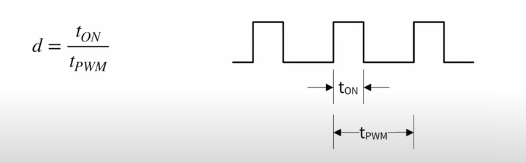
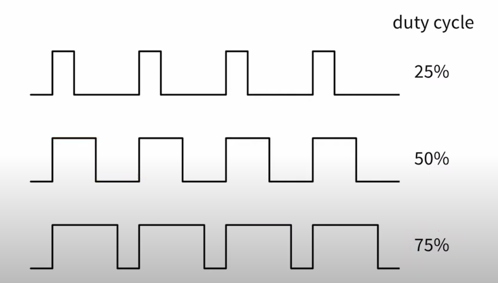
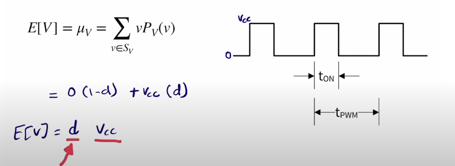
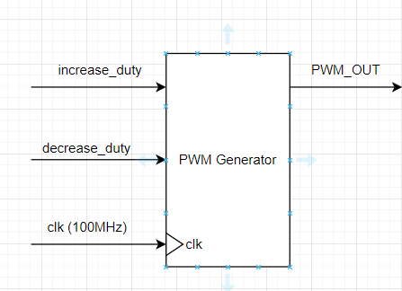
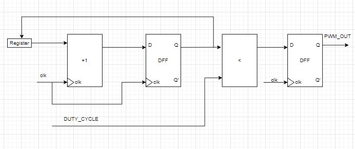
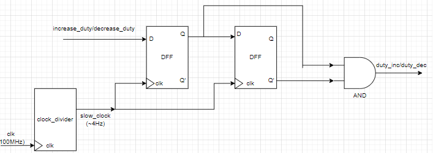
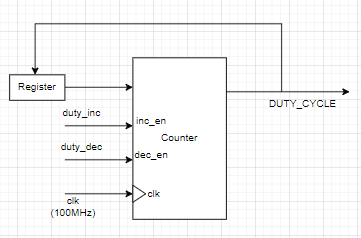
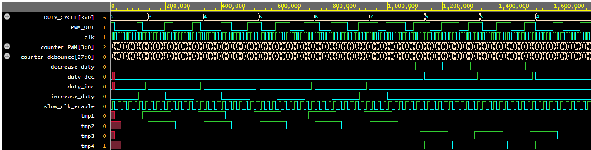

# PWM(Pulse width modulation) Generator
This Project is about design and simulation of PWM generator with variable duty cycle.

# Introduction 

By dividing an electrical signal into discrete pieces, pulse-width modulation (PWM) or pulse-duration modulation (PDM) is a technique for lowering the average power produced by an electrical signal.
By rapidly flipping the switch between the supply and the load on and off, the average amount of voltage (and current) provided to the load is managed. 
The total power provided to the load increases while the switch is on for a longer period of time compared to when it is off. 
Depending on the load and application, the power supply's switching rate (or frequency) might change significantly.


## Duty Cycle:

A low duty cycle equates to low power because the electricity is off for the most of the time; the word duty cycle reflects the ratio of "on" time to the regular interval or "period" of time. 
Duty cycle is measured in percentages, with 100 percent representing total on. 
A digital signal has a duty cycle of 50% and looks like a "square" wave when it is on for 50% of the time and off for the other 50%. 
A digital signal has a duty cycle of >50% when it spends more time in the on state than the off state.
A digital signal has a duty cycle of 50% when it spends 50% more time in the off state than the on state.

  

  

About power:

  

## Application:
* Servos
* Telecommunications
* Power Delievery
* Voltage regulation
* Audio effects and amplification
* Soft blinking LED indicator

# Block Diagram
This PWM generator generates 10Mhz signal. We can control duty cycles in steps of 10%. 
The default duty cycle is 50%. Along with clock signal we provide another two external signals to increase and decrease the duty cycle.

  

The key components we need for this particular circuit are an n-bit counter and comparator. 
The duty passed to the comparator is compared to the counter's current value. 
If the counter's current value is less than the required value, the comparator produces a high output. 
Similar to this, if the counter's current value is higher than its duty, the comparator's output will be low. Since the counter starts at zero, the comparator initially produces a large output, which decreases as the counter approaches its duty. 
Therefore, we can manage duty cycle by managing duty.

## PWM Generator Synthesis block:
  

Since the counter is sequential and the comparator is a combinational circuit, there may be an intermediate state like 111 that is higher or lower than duty when counting from 011 to 100 as a result of inappropriate delays. 
A glitch might result from this. The output of the comparator is routed through a D flipflop in order to prevent these errors.

## Button signal debounce:

Mechanical switches/ buttons cause an unpredictable bounce in the signal when toggled. There are various ways to implement debouncing circuits for buttons.

  

### Button signal debounce code:

```SystemVerilog
// Code your design here
module DFF_PWM(
	input logic clk,
  	input logic en,
  	input logic D,
  	output logic Q,
  	output logic Q_not
);
  
  always_ff @(posedge clk)	begin: D_ffs
    if(en)	begin
      Q<=D;
      Q_not<=~D;
    end
  end: D_ffs
endmodule: DFF_PWM

module debounce_DFF(
	input logic clk,
  	input logic button,
  	output logic pulse_out

);
  logic tmp1,tmp2,tmp3,tmp4;
  logic slow_clk_enable;
  logic [27:0] counter_debounce=0;// counter for creating slow clock enable signals 
always_ff @(posedge clk)	begin: debouncing_ffs
    counter_debounce <= counter_debounce + 1;
  if(counter_debounce>=1) 
    counter_debounce <= 0;
  end: debouncing_ffs
  
assign slow_clk_enable = counter_debounce == 1 ?1:0;
  // debouncing FFs for increasing button
  DFF_PWM PWM_DFF1(clk,slow_clk_enable,button,tmp1,tmp2);
  DFF_PWM PWM_DFF2(clk,slow_clk_enable,tmp1, tmp3,tmp4); 
assign pulse_out =  tmp1 & tmp4 &slow_clk_enable;
 // debouncing FFs for decreasing button
//  DFF_PWM PWM_DFF3(clk,slow_clk_enable,decrease_duty, tmp3);
//  DFF_PWM PWM_DFF4(clk,slow_clk_enable,tmp3, tmp4); 
// assign duty_dec =  tmp3 & (~ tmp4) & slow_clk_enable;
endmodule: debounce_DFF
```
  

## Increase/Decrease Duty cycle block:

  

## Full design code:

```SystemVerilog

module DFF_PWM(
	input logic clk,
  	input logic en,
  	input logic D,
  	output logic Q
);
  
  always_ff @(posedge clk)	begin: D_ffs
    if(en)	begin
      Q<=D;
    end
  end: D_ffs
endmodule: DFF_PWM

module PWM_Generator(
	input logic clk,
  	input logic increase_duty,
  	input logic decrease_duty,
  	output logic PWM_OUT
);
  
logic slow_clk_enable; // slow clock enable signal for debouncing FFs
logic [27:0] counter_debounce=0;// counter for creating slow clock enable signals 
logic tmp1,tmp2,duty_inc;// temporary flip-flop signals for debouncing the increasing button
logic tmp3,tmp4,duty_dec;// temporary flip-flop signals for debouncing the decreasing button  
logic [3:0] counter_PWM=0;// counter for creating 10Mhz PWM signal
logic [3:0] DUTY_CYCLE=2; // initial duty cycle is 50%
  
  always_ff @(posedge clk)	begin: debouncing_ffs
    counter_debounce <= counter_debounce + 1;
    if(counter_debounce>=1) 
    counter_debounce <= 0;
  end: debouncing_ffs
  
assign slow_clk_enable = counter_debounce == 1 ?1:0;
  // debouncing FFs for increasing button
 DFF_PWM PWM_DFF1(clk,slow_clk_enable,increase_duty,tmp1);
 DFF_PWM PWM_DFF2(clk,slow_clk_enable,tmp1, tmp2); 
assign duty_inc =  tmp1 & (~ tmp2) & slow_clk_enable;
 // debouncing FFs for decreasing button
 DFF_PWM PWM_DFF3(clk,slow_clk_enable,decrease_duty, tmp3);
 DFF_PWM PWM_DFF4(clk,slow_clk_enable,tmp3, tmp4); 
assign duty_dec =  tmp3 & (~ tmp4) & slow_clk_enable;
  
  always_ff @(posedge clk)	begin: DUTY_CONTROL_FFs
    if(duty_inc==1 && DUTY_CYCLE<=9)	begin: increase_duty_cycle
      DUTY_CYCLE<=DUTY_CYCLE+1;
    end: increase_duty_cycle
    else if(duty_dec==1 && DUTY_CYCLE>0)	begin: decrease_duty_cycle
      DUTY_CYCLE<=DUTY_CYCLE-1;
    end: decrease_duty_cycle
  end: DUTY_CONTROL_FFs
  
  always_ff @(posedge clk)	begin: PWM_GEN_FFs
   counter_PWM <= counter_PWM + 1;
    if(counter_PWM>=9) begin
    	counter_PWM <= 0;
    end
    
 end: PWM_GEN_FFs
  
 assign PWM_OUT = counter_PWM < DUTY_CYCLE ? 1:0;
  
endmodule: PWM_Generator

```

  
